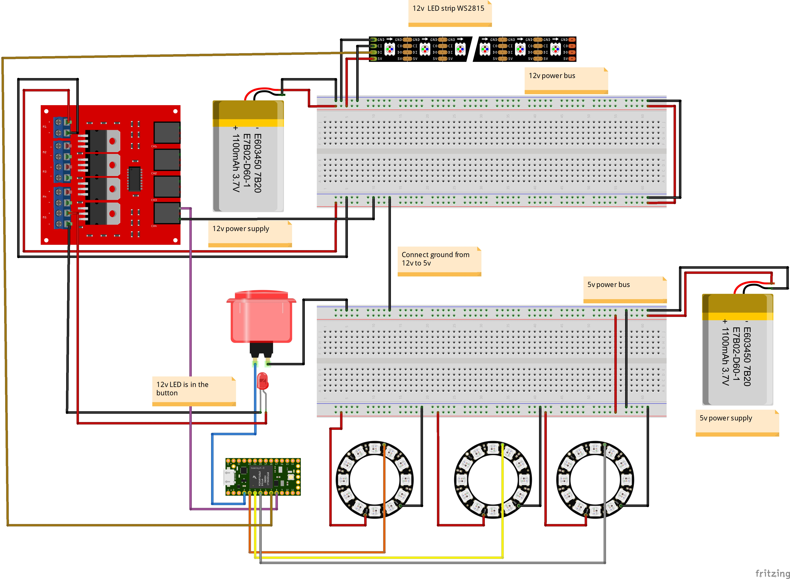
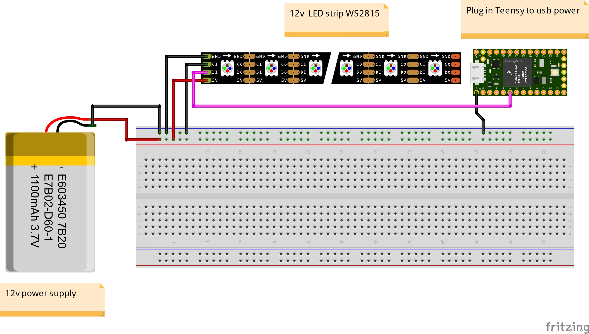
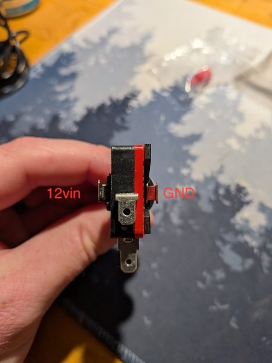

# GCN26 Mission Control 

Overview
Mission Control is a Teensy 4.0-based LED sequencing system. A Node.js application communicates with the Teensy over serial to trigger three NeoPixel rings one at a time. Once all three rings are fully lit green, a MOSFET enables a 12V arcade button LED. Pressing the button toggles a 684-pixel WS2815 12V LED strand on and off.

------------------------------------------------------------------------

Full circuit

Strip testing circuit

Arcade button LED pinout

Hardware

Pin Assignments
Pin
Assignment
Pin 2
Arcade button input (INPUT_PULLUP)
Pin 4
WS2815 strand data (DIN)
Pin 5
MOSFET gate — arcade button 12V LED
Pin 6
NeoPixel Ring 1 data
Pin 7
NeoPixel Ring 2 data
Pin 8
NeoPixel Ring 3 data

Components
Component
Details
Microcontroller
Teensy 4.0
LED Strand
WS2815 12V, 60px/m — 684 pixels total
NeoPixel Rings
3x 16-pixel rings (48 pixels total)
Arcade Button
12V illuminated arcade button
MOSFET Board
IRF540 MOSFET driver board
Power Supply
12V supply — minimum 20A for full strand

Wiring Notes

WS2815 Strand (4-Pin)
	•	12V → 12V power supply
	•	GND → power supply GND (shared with Teensy GND)
	•	DIN → Teensy Pin 4
	•	BI (Backup Input) → GND on the first pixel only

The BI pin provides a pixel-skip failsafe — if one pixel dies, the rest of the strand continues to work. You only need to wire BI on the first injection point. The strip handles it internally between pixels after that.

	•	Level shifter recommended: Teensy outputs 3.3V logic. A 3.3V→5V level shifter on the data line improves reliability over long runs.

MOSFET Board (IRF540)
	•	MOSFET gate → Teensy Pin 5
	•	MOSFET drain → arcade button LED negative terminal
	•	MOSFET source → GND
	•	12V → arcade button LED positive terminal

The MOSFET pin stays LOW (button LED off) until all 3 NeoPixel rings have been fully lit by serial command. It is set HIGH only once all three rings are complete.

Power
	•	12V and GND lines to the WS2815 strand must be 16 AWG or heavier
	•	Always fuse the 12V line close to the power supply — use a 25A fuse for the full 684 pixel run
	•	Teensy is powered via USB or its own 5V rail — do not power Teensy from the 12V supply directly
	•	Share a common GND between the Teensy, MOSFET board, and 12V power supply

------------------------------------------------------------------------

Software

Dependencies
	•	Arduino IDE with Teensyduino add-on
	•	Adafruit NeoPixel library (handles WS2815 — no separate library needed)

Serial Protocol
The Teensy communicates with the Node.js application at 115200 baud. Commands are single ASCII characters sent from Node.js. Status messages are returned from the Teensy.

Commands (Node.js → Teensy)
Command
Action
'1'
Light Ring 1 green (pixel by pixel)
'2'
Light Ring 2 green (pixel by pixel)
'3'
Light Ring 3 green (pixel by pixel)

Status Messages (Teensy → Node.js)
Message
Meaning
STATUS:RING1_COMPLETE
Ring 1 fully lit
STATUS:RING2_COMPLETE
Ring 2 fully lit
STATUS:RING3_COMPLETE
Ring 3 fully lit
STATUS:ALL_RINGS_COMPLETE
All rings done — MOSFET fired, button enabled
STATUS:STRAND_ON
Button pressed — WS2815 strand lit white
STATUS:STRAND_OFF
Button pressed again — strand cleared

Startup Behavior
	•	On power-up, all LEDs are off and the MOSFET pin is LOW
	•	Teensy waits for serial commands — rings do NOT light automatically
	•	Node.js sends '1', '2', '3' to trigger each ring sequentially
	•	Each ring fills pixel by pixel with a 30ms delay between pixels
	•	Once all 3 are complete, MOSFET fires HIGH and the arcade button LED turns on
	•	The arcade button is ignored until ringsComplete is true

Button Behavior
	•	First press: WS2815 strand lights solid white at full brightness
	•	Second press: Strand clears
	•	Button press includes 50ms debounce and waits for release before returning to loop

Configuration
All key parameters are defined at the top of the sketch for easy adjustment:

#define BUTTON_PIN      2     // Arcade button input
#define MOSFET_PIN      5     // MOSFET gate
#define RING1_PIN       6     // Ring 1 data
#define RING2_PIN       7     // Ring 2 data
#define RING3_PIN       8     // Ring 3 data
#define RING_PIXELS     16    // Pixels per ring
#define STRAND_PIN      4     // WS2815 data
#define STRAND_PIXELS   684   // Total strand pixels
#define RING_PIXEL_DELAY 30   // ms per pixel on ring fill

------------------------------------------------------------------------

Power Requirements
Load
Estimate
684px WS2815 full white
~20A @ 12V
3x 16px NeoPixel rings
~0.3A @ 5V
Arcade button LED
< 0.1A @ 12V
Teensy 4.0
~0.1A @ 5V
Recommended PSU
12V / 25A minimum for strand

Note: For testing with 10 pixels, a 12V / 1A supply is sufficient. Scale up before deploying the full 684 pixel run.

Troubleshooting
Symptom
Likely Cause
Colors wrong (e.g. red shows as green)
Swap NEO_GRB to NEO_RGB in strand definition
Strand flickers or drops pixels
Weak power supply or missing level shifter on data line
Rings don't light
Check serial baud rate matches (115200) and commands are single ASCII chars
Button has no effect
ringsComplete is false — all 3 ring commands must be sent first
MOSFET not firing
Check Pin 5 wiring to gate; verify GND is shared with MOSFET board
12V wire burns
Wire gauge too thin or loose connection — use 16 AWG minimum, add inline fuse

